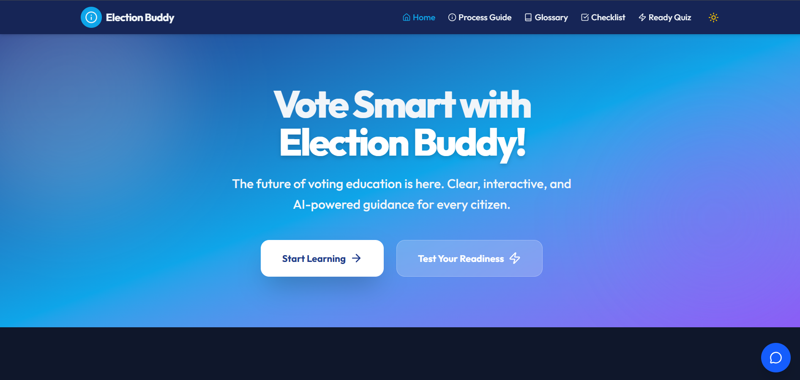

<div align="center">

# 🗳️ VoteSmart AI

### *Empowering Every Vote with Artificial Intelligence*

[](https://vote-smart-7tdspij4g-virakshi07s-projects.vercel.app)
[](https://reactjs.org/)
[](https://ai.google.dev/)
[](CONTRIBUTING.md)

<br/>


 **"The future of voting education is here — AI-powered guidance for every citizen."**

<br/>

## 🚀 Live Demo

https://vote-smart-jakwy9nrd-virakshi07s-projects.vercel.app/

## 📸 Demo Preview

<p align="center">
  
</p>

</div>

---

## 📖 What is VoteSmart AI?

**VoteSmart AI** is a modern, AI-driven web application that transforms the way citizens — especially **first-time voters** — learn about and navigate the electoral process. Gone are the days of confusing government pamphlets and overwhelming bureaucratic jargon.

With VoteSmart AI, users get:
- 🤖 **Real-time AI answers** to any voting-related question
- 📋 **Structured step-by-step guidance** through registration and voting
- ✅ **Interactive checklists** to ensure voters are fully prepared
- 🧠 **Quizzes** to test and reinforce knowledge before election day

---

## ✨ Features

### 🤖 AI-Powered Chatbot — *Election Buddy*
Meet **Election Buddy**, your personal voting assistant. Powered by Google Gemini AI, it answers real-time questions about voter registration, eligibility, ID requirements, polling procedures, and more — in plain, friendly language.

> 💡 *Built-in fallback responses ensure reliability even during API quota limits, so users are never left without guidance.*

### 🗺️ Process Guide
A clear, visual, step-by-step walkthrough of the entire voting process — from registration to casting your ballot. No confusion, no guesswork.

### 📚 Glossary
An A-Z reference of electoral terms and concepts, explained in simple language perfect for first-time voters.

### ✅ Interactive Checklist
A smart, actionable checklist to help voters gather required documents and complete every step before election day.

### ⚡ Ready Quiz
An engaging quiz experience that tests your voting knowledge and ensures you're 100% prepared when it counts.

---

## 🎯 Who Is This For?

| Audience | How VoteSmart AI Helps |
|---|---|
| 🧑 **First-time voters** | Demystifies the entire voting process from scratch |
| 🌍 **New citizens** | Explains local electoral procedures clearly |
| 🏫 **Students & educators** | A trustworthy civic education resource |
| ♿ **Accessibility-focused users** | Simple language and intuitive UI for all |

---

## 🛠️ Tech Stack

```
┌─────────────────────────────────────────────────┐
│                  VoteSmart AI                   │
├────────────────┬────────────────────────────────┤
│   Frontend     │  React + TypeScript + Vite     │
│   Styling      │  Tailwind CSS                  │
│   Animations   │  Framer Motion                 │
│   Backend      │  Vercel Serverless Functions   │
│   AI Model     │  Google Gemini AI              │
│   Deployment   │  Vercel                        │
└────────────────┴────────────────────────────────┘
```

### Why This Stack?
- **React + TypeScript** — Type-safe, component-driven UI for reliability
- **Vercel Serverless** — API keys stay secure server-side; no exposure to the client
- **Google Gemini AI** — State-of-the-art conversational AI for accurate, helpful responses
- **Framer Motion** — Smooth, polished animations for a premium user experience

---

## 🚀 Getting Started Locally

### Prerequisites
- Node.js `v18+`
- npm or yarn
- A Google Gemini API key from [aistudio.google.com](https://aistudio.google.com)

### 1. Clone the Repository
```bash
git clone https://github.com/your-username/votesmart-ai.git
cd votesmart-ai/election-buddy
```

### 2. Install Dependencies
```bash
npm install
```

### 3. Set Up Environment Variables
Create a `.env` file in the root of `election-buddy/`:
```env
GEMINI_API_KEY=your_gemini_api_key_here
```

### 4. Run the Development Server
```bash
npm run dev
```

Visit `http://localhost:5173` in your browser. 🎉

### 5. Run the Backend (API)
The backend uses Vercel serverless functions. To test locally:
```bash
npm install -g vercel
vercel dev
```

---

## 📁 Project Structure

```
votesmart-ai/
└── election-buddy/
    ├── api/
    │   └── chat.ts          # Serverless function — AI integration
    ├── src/
    │   ├── components/
    │   │   └── ChatbotFAB.tsx   # Floating AI chatbot UI
    │   ├── pages/           # Process Guide, Glossary, Checklist, Quiz
    │   ├── services/
    │   │   └── geminiService.ts # API communication layer
    │   └── App.tsx
    ├── .env                 # Local environment variables
    ├── vite.config.ts
    └── package.json
```

---

## 🔒 Security & Reliability

- 🔑 **API keys are never exposed** to the client — all AI calls go through secure serverless functions
- 🛡️ **Graceful error handling** — if the AI service is unavailable, users receive a friendly fallback message
- ⚡ **Rate limit resilience** — the app handles quota errors gracefully without crashing

---

## 🤝 Contributing

Contributions are what make open source amazing! Here's how to get involved:

1. **Fork** the repository
2. Create a feature branch: `git checkout -b feature/amazing-feature`
3. Commit your changes: `git commit -m 'Add amazing feature'`
4. Push to the branch: `git push origin feature/amazing-feature`
5. Open a **Pull Request**

Please read [CONTRIBUTING.md](CONTRIBUTING.md) for our code of conduct and contribution guidelines.

---

## 🗺️ Future Improvements Roadmap

- [ ] 🌐 Multi-language support
- [ ] 📍 Location-based voting information
- [ ] 📱 Progressive Web App (PWA) support
- [ ] 🔔 Election day reminders
- [ ] 📊 Voting statistics dashboard

---


<div align="center">

### Built with ❤️ to make democracy more accessible

**[Live Demo](https://vote-smart-7tdspij4g-virakshi07s-projects.vercel.app)** • **[Report Bug](../../issues)** • **[Request Feature](../../issues)**

<br/>

*VoteSmart AI — Because every informed vote matters.* 🗳️

</div>
